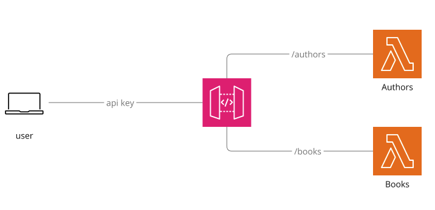

# CDK Workshop 1
Welcome to the CDK Workshop! In this session, we’ll learn how to use the AWS Cloud Development Kit (CDK) to design, implement, and deploy a serverless API for a fictional book shop, featuring routes for managing authors and books.

## Workshop Objectives
By the end of this workshop, you will:

1) Understand the Basics of AWS CDK:

    * Set up a CDK project.
    * Define infrastructure as code using Javascript.

2) Build a Serverless API:

    * Use AWS Lambda to handle API logic.
    * Integrate Amazon API Gateway to expose HTTP endpoints.
    * Secure our API with keys

3) Define Two API Routes:

    * /authors – Return author information.
    * /books – Return book details.

4) Deploy and Test:

    * Deploy the API to AWS.
    * Test its functionality using tools like Postman or curl.
    * Write unit tests to verify our infrastucture setup

## What We'll Build
The Book shop API is a simple API designed to showcase the power of AWS CDK. It includes:

* Two routes:
  1. /authors: Retrieve authors.
  2. /books: Retrieve books.
* Serverless Backend:
  * API Gateway for routing requests.
  * Lambda functions to handle the logic for each route.

The Book Shop API:

## Tasks
0. [Setup](./tasks/000-setup.md)
1. [Task 1 - Initialising our repo](./tasks/001-task-1.md)
2. [Task 2 - Creating a Lambda function](./tasks/002-task-2.md)
3. [Task 3 - Testing our stack](./tasks/003-task-3.md)
4. [Task 4 - Adding an API Gateway Route](./tasks/004-task-4.md)
5. [Task 5 - Securing our API](./tasks/005-task-5.md)
6. [Task 6 - Adding a Books route](./tasks/006-task-6.md)
7. [Task 7 - Tearing down our stack](./tasks/007-task-7.md)

Let's get going! 🚀
