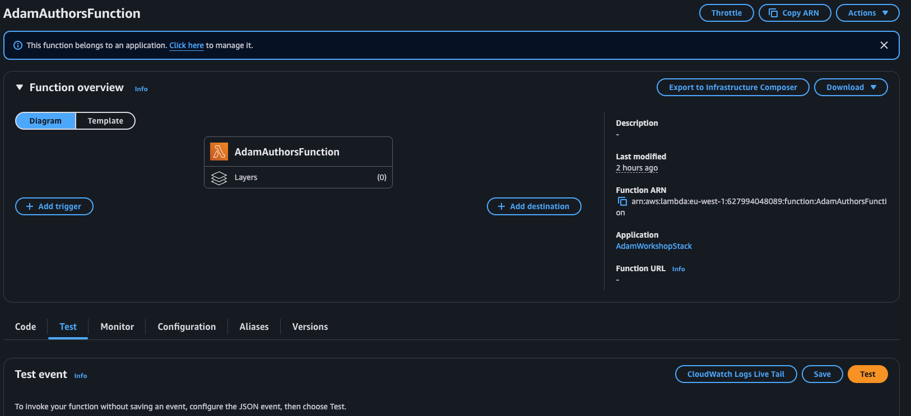

# 2️⃣ Task 2 - Creating a Lambda function
The first resource we'll create for our application will be a Lambda function and the associated handler code.

## Create the Lambda handler code
A Lambda handler is the entry point for an AWS Lambda function. It is the function that AWS Lambda calls to start executing your code whenever the function is invoked. The handler processes the event data passed to the Lambda function and typically returns a response or performs an action.

Let's go ahead and create a handler. Don't worry, we'll keep things simple for this workshop!

Within your project root `[your-name]-workshop/`, create a new `lambda/` directory:

```sh
mkdir lambda
```

Within this new directory, create a new file called `authors.js`

```sh
cd lambda
touch authors.js
```

Within this file, you can add the following code (we'll include some fake data as well):

```js

// feel free to replace this with some author data of your choice!
const authors = [
  {
    id: 1,
    name: "Jane Austen",
    genre: "Fiction",
    nationality: "British",
  },
  {
    id: 2,
    name: "Mark Twain",
    genre: "Fiction",
    nationality: "American",
  },
  {
    id: 3,
    name: "Toni Morrison",
    genre: "Literary Fiction",
    nationality: "American",
  },
];

exports.handler = async function (event) {
  console.log("request:", JSON.stringify(event, undefined, 2));
  return {
    statusCode: 200,
    headers: { "Content-Type": "text/plain" },
    body: authors,
  };
};
```

Make sure to save these changes.

ℹ️ Take note of the returned value: `{statusCode, headers, body}`. This format is required when using API Gateway (which we’ll be working with soon) because API Gateway relies on this structure to generate an HTTP response. However, if you’re running a Lambda function independently, you can return any format you prefer. 😀

## Update our CloudFormation stack
We'll now go ahead and create our Lambda resource within our stack.

BUT...before we go any further, let's answer a quick question...

### What IS a "stack"?
Good question!

A CloudFormation stack is a collection of AWS resources that are created and managed together as a single unit. Think of it like a blueprint that defines everything your application needs in the cloud—such as servers, databases, and permissions.

In the context of CDK, a stack is where we group and define the AWS resources we want to deploy. For example, if we’re building a "Book Shop" API, we could have one stack that includes resources like Lambda functions for backend logic, an API Gateway for handling requests, and a DynamoDB table for storing data.

When we deploy the CDK app, the stack gets translated into CloudFormation templates, which AWS uses to provision and configure the resources automatically.

I hope that makes sense?

Let's continue...

## Creating the Lambda function

ℹ️ _As you implement this code, I recommend writing it out manually rather than copying and pasting. This will help you get a better understanding of how to structure constructs and define attributes._

Within the `lib/[your-name]-workshop-stack.js` file, add the following code:

```js
const { Stack } = require("aws-cdk-lib");
const lambda = require("aws-cdk-lib/aws-lambda");

class YourNameWorkshopStack extends Stack {
  constructor(scope, id, props) {
    super(scope, id, props);

    // Define the Authors Lambda function resource
    const authorsFunction = new lambda.Function(this, "[YourName]AuthorsFunction", {
      runtime: lambda.Runtime.NODEJS_20_X,
      code: lambda.Code.fromAsset("lambda"),
      functionName: "[YourName]AuthorsFunction", // e.g AdamAuthorsFunction
      handler: "authors.handler",
    });
  }
}

module.exports = { YourNameWorkshopStack };
```

Let's break down what's happening here...

---

### Imports

```js
const { Stack } = require("aws-cdk-lib");
const lambda = require("aws-cdk-lib/aws-lambda");
```

These lines import everything we need to create our stack and Lambda resource. the `aws-cdk-lib/aws-lambda` module provides classes and constructs for creating and managing Lambda functions.

---
### Constructor

```js
class YourNameWorkshopStack extends Stack {
  constructor(scope, id, props) {
    super(scope, id, props);
```
_Make sure you're replacing `YourName` with your actual name_ 🫣

This defines a new class called YourNameWorkshopStack that inherits (or extends) from the Stack class provided by AWS CDK. This means YourNameWorkshopStack is a custom stack where you'll define AWS resources.

The constructor is a special method that initialises the stack. It's called when you create a new instance of the YourNameWorkshopStack class.

* `scope` refers to the parent construct in which this stack is being created (usually the CDK application)
* `id` is a unique identifier for this stack
* `props` is an optional object that can be used to pass additional config or input values for the stack.

`super(scope, id, props);` calls the constructur of the parent `Stack` class, passing in our `scope`, `id`, and `props`.

---
### Actually creating our function

```js
const authorsFunction = new lambda.Function(this, "[YourName]AuthorsFunction", {
      runtime: lambda.Runtime.NODEJS_20_X,
      code: lambda.Code.fromAsset("lambda"),
      functionName: "[YourName]AuthorsFunction", // e.g AdamAuthorsFunction
      handler: "authors.handler",
    });
```
This function is creating a new AWS Lambda function called `[YourName]AuthorsFunction`. Here's what each of the attribues mean:

* `runtime`: Specifies the programming language and version the Lambda function will use—in this case, Node.js 20.x.

* `code`: Points to the folder ("lambda") where the code for the function is stored. The CDK will package this folder and upload it to AWS.

* `functionName`: Gives the function a name—something like AdamAuthorsFunction.

* `handler`: Specifies the entry point of the code. Here, it's looking for a file called authors.js in the "lambda" folder and running the handler function from it.

These are the basic required props for creating a Lambda function but there are a whole host of other constructor props you can pass to configure your functions in more detail.

See [here](https://docs.aws.amazon.com/cdk/api/v2/docs/aws-cdk-lib.aws_lambda.Function.html#construct-props) for a full list of Lambda constructor props.

ℹ️ _It's often better to omit the `functionName` attribute, as manually setting a name can complicate updates and management. By default, the AWS CDK generates a unique name for your Lambda function based on the stack name and logical ID ([YourName]AuthorsFunction in this case), ensuring consistency and avoiding conflicts. However, we'll use a `functionName` for the purpose of this workshop so we can easily identify our functions in the AWS console._

## Checking our CloudFormation before deployment
We've added our Lambda function to our stack, and we've created the handler code for the Lambda to execute 👍

We're now ready to deploy our function to AWS. Before we do this, we can check that our CloudFormation is generated correctly.

To do this, we can run `cdk synth` from our project root directory:

```sh
cdk synth
```
You'll notice the output of this command looks a bit like CloudFormation (if you know what CLoudFormation looks like). That's because it is CloudFormation!

### What does CDK synth do?
The cdk synth command generates a CloudFormation template from your CDK application code. It resolves all constructs and configurations defined in your app into a JSON template, saved in the cdk.out directory.

If you look in your `[your-name]-workshop/cdk.out/` directory, you should see a `[StackName].template.json` file. This allows you to preview the infrastructure resources and settings before deployment.

This command will fail if you've any errors within your stack code.

## Deploying your function
Now we're happy that our CloudFormation generates successfully, we can deploy our stack to AWS. To do this, we simply run:

```sh
cdk deploy
```

This command will synthesise your CloudFormation (if not already done), upload our lambda code to a private S3 (hidden away from us) and creates the specified CloudFormation stack in AWS.

During a deployment, CDK will often need to create, update or remove roles and permissions in order for things to execute properly. You will be prompted to confirm these change before the deployment can continue.

You should see a deployment successfull message once it has complete (it may take a few minutes).

## Checking your function in the AWS console.

Once your function has successfully deployed, you can verify it's there and working by logging in to the AWS console. The workshop facilitator should be able to provide you with the log on details.

Once logged in, navigate to the `Lambda` console and select `Functions` from the left hand menu.

Here you should see the name of the lambda function that you've just deployed.

To test that your function is working, click on the name of your function and select the `Test` tab underneath the function overview.



Clicking the Test button below will execute your function, and you should see a successful result displaying your author data from the Lambda handler.


## Checklist
- [ ] Created /lambda directory and authors.js file
- [ ] Added a lambda function to our stack
- [ ] Ran `cdk synth` to check CloudFormation builds correctly
- [ ] Ran `cdk deploy` to deploy our function to AWS
- [ ] Logged into the AWS console to verify lambda function is present and working correctly.

All done? Great! Let's add some tests in for our stack.

Go to [Task 3](003-task-3.md)

## ℹ️ Useful Tip
If you run into any issues, you can refer to a completed version of the code to see how it should look at the end of this task.

[Task 2 code](https://github.com/ajroberts10/cdk-workshop-1/tree/002-task-2)


