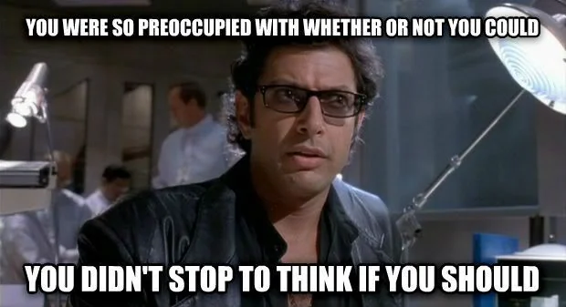

# 3️⃣ Task 3 - Testing our stack
CDK allows us to write unit tests for our infrastructure—yes, unit tests for infrastructure! These tests help ensure that our stack includes all the required resources and that they are defined correctly. To make this easier, CDK offers tools and libraries like assertions and snapshots.

BUT...



Thanks for the warning Dr Malcolm! When testing infrastucture, we need to consider the value we're getting from our tests and the effort to write and maintain them. It's easy to get bogged down trying to test every resource and attribute when all you really care about is that your stack has enough stuff present to work properly. Below are some general rules I like to apply when considering unit tests:

* If the app isn't going to work without a resource, assert that is defined
* If two or more resources have a relationship (such as an IAM policy statement), assert that it is defined
* If a resource has important additional configuration values, describe them in a separate test or tests
* If a resource has unimportant additional configuration values, omit them
* If a resource contains deployable code, test it separately outside of infrastructure unit tests
* If a test has a poor effort-to-value ratio, e.g. the setup removes too many layers of library abstraction, or the resulting proof requires circular logic or is based on too many assumptions, omit it in favour of integration testing
* Don't use snapshots for multiple resources or arbitrary values
* Do use snapshots to record important properties that have a much lower level of abstraction, for example complex CloudFormation function chains.

OK, so now when know when to write tests, how do we actually write a test?

## 3.1 - Writing our first unit test
Fortunately for us, when we originally ran `cdk init` it created a boilerplate `/test` directory within our project root folder. It should also have created a test file specifically for your newly created stack.

How helpful!

If you open this file (`[yourName]-workshop.test.js` for example) you'll notice that it has probably set up a dummy test for an SQS queue or something like that.

We can get rid of this code and replace it with a test for our newly created authors Lambda function.

```js
const cdk = require("aws-cdk-lib");
const { Template } = require("aws-cdk-lib/assertions");
const YourNameWorkshop = require("../lib/yourName-workshop-stack");


test("Author Lambda Function Created", () => {
  const app = new cdk.App();

  const stack = new YourNameWorkshop.YourNameWorkshopStack(app, "MyTestStack");

  const template = Template.fromStack(stack);

  template.hasResourceProperties("AWS::Lambda::Function", {
    FunctionName: "YourNameAuthorsFunction",
  });
});
```

ℹ️ Remember to replace `YourName` with your actual name of your stacks and functions!

This test does the following three things:

- It initialises a CDK application and a stack instance (YourNameWorkshopStack) for testing.
- Using the CDK assertions library, it generates the CloudFormation template for the stack.
- The test checks that the stack includes an AWS Lambda function with the specified property `FunctionName: "YourNameAuthorsFunction"`

## 3.2 - Running our tests
To run the tests, we can simply run `npm test` from our project root directory.

The test should run successfully. If you would like to see it fail, try changing the expected name of your lambda function within the test file and run the tests again.

## Checklist
- [ ] Read Dr Malcolm's advice about when to write tests for infrastructure
- [ ] Updated our test file with our author lambda function test
- [ ] Ran the tests
- [ ] Forced a failure of the tests

Fab! Let's continue.

Go to [Task 4](004-task-4.md)

## ℹ️ Useful Tip
If you run into any issues, you can refer to a completed version of the code to see how it should look at the end of this task.

[Task 3 code](https://github.com/ajroberts10/cdk-workshop-1/tree/003-task-3)
