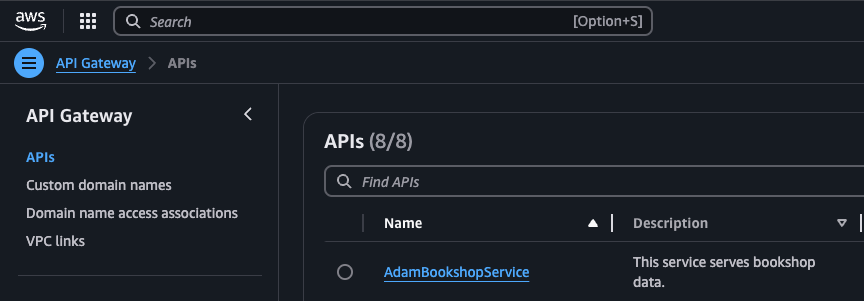
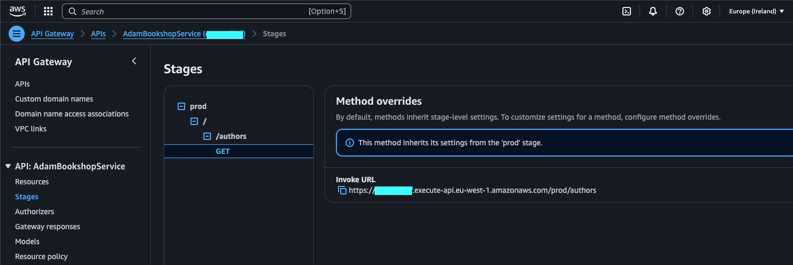

# 4️⃣ Task 4 - Adding an API Gateway Route
To make our Author Lambda function accessible to the outside world, we can set up an API Gateway and define a route that triggers the function when called. This allows us to expose the Lambda function via a secure (we'll get to this bit later!) and scalable HTTP endpoint.

## Adding our API Gateway route
Within our `/lib/[yourName]-workshop-stack.js` file, add the following code underneath your lambda definition:

```js
    // CREATED IN TASK 2.....
    const authorsFunction = new lambda.Function(this, "YourNameAuthorsFunction", {
      runtime: lambda.Runtime.NODEJS_20_X,
      code: lambda.Code.fromAsset("lambda"),
      functionName: "YourNameAuthorsFunction", // e.g AdamAuthorsFunction
      handler: "authors.handler",
    });

    // Create the API Gateway
    const api = new apigateway.RestApi(this, "YourNameBookshopApi", {
      restApiName: "YourNameBookshopService",
      description: "This service serves bookshop data.",
    });

    // Create the /authors route and connect it to our Authors Lambda function
    const authors = api.root.addResource("authors");
    authors.addMethod("GET", new apigateway.LambdaIntegration(authorsFunction));
```

Let's discuss what is going on here.

---

### Creating the API Gateway

```js
const api = new apigateway.RestApi(this, "YourNameBookshopApi", {
      restApiName: "YourNameBookshopService",
      description: "This service serves bookshop data.",
    });
```
- This creates a new REST API using API Gateway, named "YourNameBookshopService" with a description of "This service serves bookshop data.".
- The api object represents the API Gateway instance that will handle HTTP requests.

 ---

### Creating the /authors Route

```js
const authors = api.root.addResource("authors");
```
- This creates a new route/resource called `/authors` under the root path of the API Gateway.
- The `authors` variable now refers to the `/authors` route that clients can interact with.

 ---

### Adding a GET Method to the /authors Route

```js
authors.addMethod("GET", new apigateway.LambdaIntegration(authorsFunction));
```
- This adds a GET HTTP method to the /authors route, meaning that when a client sends a GET request to /authors, it will trigger the associated Lambda function (authorsFunction).
- The LambdaIntegration is used to link the authorsFunction Lambda to the API Gateway, ensuring that the function is invoked when the route is accessed.

## Add a test for our API Gateway instance
As the API Gateway is an integral part of our application, it probably makes sense for us to add a test to check it's present.

We'll keep this pretty simple for now but update your test file with the following test:

```js
test("API Gateway Created with /authors Route and Lambda Integration", () => {
  const app = new cdk.App();

  const stack = new AdamWorkshop.AdamWorkshopStack(app, "MyTestStack");

  const template = Template.fromStack(stack);

  // Assert that the /authors resource exists and is integrated with a Lambda function
  template.hasResourceProperties("AWS::ApiGateway::Resource", {
    PathPart: "authors",
  });

   // Check that the GET method for /authors is using Lambda integration
  template.hasResourceProperties('AWS::ApiGateway::Method', {
    AuthorizationType: 'NONE',
    HttpMethod: 'GET',
    Integration: {
      IntegrationHttpMethod: 'POST',
      Type: 'AWS_PROXY',  // AWS_PROXY is the integration type for Lambda functions
    },
  });
});
```

This test should check the following:
- We check if a resource (AWS::ApiGateway::Resource) exists with the PathPart property set to authors, ensuring the /authors route is created.
- We assert that the GET method on /authors has the correct Lambda integration, specifically checking for the `AWS_PROXY` integration type, which indicates that the Lambda function is triggered by this route.

## Deploy our API Gateway route to AWS
We can deploy our newly created API Gateway instance to AWS using:

```sh
cdk deploy
```

You can run `cdk synth` prior to this if you'd like to check that your CloudFormation generates correctly.

When deploying, you'll probably need to confirm that you're happy to make the IAM Statement Changes. These are required to give API Gateway the permission to invoke the lambda function.

## Testing our new API Gateway route
The best way to test our new API Gateway /authors route is through a web browser using the "invoke url" that AWS generates for us. To find this url, we can navigate to the API Gateway section of the AWS console.

Once here, find your API within the list:



If you select your API name, you can navigate to the `stages` section from the left hand menu. From here you can click through to your API route to find your /authors invoke url:



The url should look something like the following:

https://[some-random-id].execute-api.eu-west-1.amazonaws.com/prod/authors

Copy and paste this into a web browser and hey presto!! You have a working API that returns author data!

Congratulations 👍

## Checklist
- [ ] Update your stack to add an API Gateway instance and /authors route
- [ ] Add a lambda integration for your authors route
- [ ] Add an associated test for your API Gateway instance
- [ ] Deploy your changes to AWS
- [ ] Find the "invoke url" for your new /authors route
- [ ] Run the url in a web browser to check the response

Now we're flying 🚀 But let's take a sec to secure things up a bit.

Go to [Task 5](005-task-5.md)

## ℹ️ Useful Tip
If you run into any issues, you can refer to a completed version of the code to see how it should look at the end of this task.

[Task 4 code](https://github.com/ajroberts10/cdk-workshop-1/tree/004-task-4)
