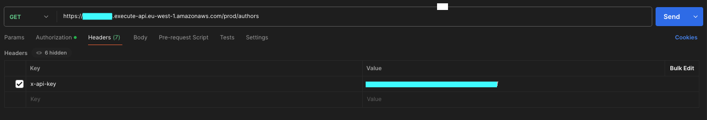

# 5️⃣ Task 5 - Securing our API
As it stands, our new API isn't very secure. Truth be told, it doesn't need to be right now since we're only returning a simple array of author data, but in a real world scenario, we'd probably want to secure it against any unauthorised access and manage request throttling.

There are multiple ways to secure an API Gateway instance, and the best method can vary based on your specific use cases. For this workshop, we'll implement a simple API key. Consumers of this API will need to include the API key in the request header to receive a response.

Let's take a look at how we can do this.

## 5.1 - Adding our API key
To add an API key to an API Gateway instance, we need to create a key and a usage plan within our stack. I can sense the next question you're already asking...

### What is a usage plan?
A usage plan in API Gateway is a way to manage and control access to our APIs. It allows us to define:

- Quota Limits: The maximum number of requests that can be made to our API within a specified time period (e.g., daily, weekly, monthly).
- Throttling Limits: The rate limit for requests, which controls how many requests per second are allowed.
- API Keys: Associating API keys with the usage plan to track and control usage by individual users or applications.

By using a usage plan, we can ensure that our API is used efficiently and fairly, preventing abuse and overuse by setting appropriate limits.

ℹ️ _This is especially useful in production environments where you need to manage resources and maintain performance._

### Updating our stack
To create the API key and usage plan, add the following code to your stack, underneath your API definition:

```js
// Create an API Key
const apiKey = new apigateway.ApiKey(this, 'YourNameApiKey', {
  apiKeyName: 'YourNameApiKey',
  description: 'API Key for My Bookshop Service'
});

// Create a Usage Plan and associate it with the API Key
const usagePlan = new apigateway.UsagePlan(this, 'YourNameUsagePlan', {
  name: 'Basic',
  apiStages: [{
    api,
    stage: api.deploymentStage
  }]
});

usagePlan.addApiKey(apiKey);
```

ℹ️ Remember to replace `YourName` with your actual name!

We also need to secure our `authors` resource on the API Gateway by requiring an API key.

To achieve this, update your authors resource definition as follows:

```js
const authors = api.root.addResource("authors");
  authors.addMethod(
    "GET",
    new apigateway.LambdaIntegration(authorsFunction),
    {
      apiKeyRequired: true,
      authorizationType: apigateway.AuthorizationType.NONE,
    }
);
```

### What is this code doing?
The first part is pretty self explanatory. It creates an API key and gives it a name and description:

```js
const apiKey = new apigateway.ApiKey(this, 'YourNameApiKey', {
  apiKeyName: 'YourNameApiKey',
  description: 'API Key for My Bookshop Service'
});
```

The following bit is used to create our usage plan:

```js
const usagePlan = new apigateway.UsagePlan(this, 'YourNameUsagePlan', {
  name: 'Basic',
  apiStages: [{
    api,
    stage: api.deploymentStage
  }]
});
```

- `new apigateway.UsagePlan(this, 'YourNameUsagePlan', {...})`: This line initialises a new usage plan named 'YourNameUsagePlan'.
- `name: 'Basic'`: This sets the name of the usage plan to 'Basic' (We don't need anything more complicated for this example).
- `apiStages: [{ api, stage: api.deploymentStage }]`: This associates the usage plan with a specific API and its deployment stage. The `api` variable represents the API Gateway instance, and `api.deploymentStage` refers to the stage of the API deployment.

Then we use the following line to assign our newly created key with our newly created usage plan:

```js
usagePlan.addApiKey(apiKey);
```

The below update is for us to specify that an API key is required to access the `authors` method, and that no other authentication methods are used:

```js
const authors = api.root.addResource("authors");
  authors.addMethod(
    "GET",
    new apigateway.LambdaIntegration(authorsFunction),
    {
      apiKeyRequired: true,
      authorizationType: apigateway.AuthorizationType.NONE,
    }
);
```

## 5.2 - Adding a test for our API Key
As the API key plays an important part in securing our new API, it's probably worth us adding a test to ensure one is created for us.

Update your test file with the following test:

```js
test("API Key Created", () => {
  const app = new cdk.App();

  const stack = new YourNameWorkshop.YourNameWorkshopStack(app, "MyTestStack");

  const template = Template.fromStack(stack);

  // Assert that an API Key resource has been created
  template.hasResourceProperties("AWS::ApiGateway::ApiKey", {
    Name: "YourNameApiKey",
  });
});
```

We can also update our previously added test to verify that our API methods now require an API key:

```js
template.hasResourceProperties("AWS::ApiGateway::Method", {
  AuthorizationType: "NONE",
  ApiKeyRequired: true,
  HttpMethod: "GET",
  Integration: {
    IntegrationHttpMethod: "POST",
    Type: "AWS_PROXY", // AWS_PROXY is the integration type for Lambda functions
  },
});
```

Run `npm test` to ensure your tests run successfully. Try changing the name of your API key to see if your tests now fail!

## 5.3 - Deploying our API key
Once we've updated our stack and added our test, we can deploy our changes to AWS.

Simply run `cdk deploy` from your project root to deploy these changes.

(Feel free to run `cdk synth` first if you'd like some extra assurance that your code is correct!)

## 5.4 - Testing our API endpoint.
Once our changes have been deployed, we can test that our endpoint is no longer accessible by simply requesting the url in the browser.

Go ahead and try it!

🚫 Computer says "no"

You may see a response similar to the following:

```json
{
  "message": "Forbidden"
}
```

This is good. It confirms that our endpoint is no longer publicly accessible.

To access this, we'll need to go and find the new API key we've just created and add this as a request header.

### Finding the API key
We can get this value from the AWS console. If you log into the console, navigate to the `API Gateway` section of the console and then click `API keys` from the left hand menu.


### Using the API key
It may be easier to do the next step with a http client such as Postman.

We can copy the API key value from the AWS console. It's then a case of doing a http GET request to our "invoke url" of our authors endpoint.

We can find this staging url by navigating to the "Stages" option in the left hand menu. Expand the options to reveal the invoke url of the authors endpoint.


When making the request, you'll need to pass your api key as an `x-api-key` header like so:



For the traditionalists amongst you, we could also use CURL to see a response in our terminal. Use the following command to try it out:

```sh
curl -H "x-api-key: yourAPIKey" https://[randomId].execute-api.eu-west-1.amazonaws.com/prod/authors
```

All being well you should see your author data being returned! Congratulations, you've just built and secured a fully functional API!

_Well...assuming your consumers only ever wanted to show customers a simple set of author data_ 😅

## Checklist
- [ ] Created an API key and usage plan
- [ ] Updated our "authors" API method definition to specify a required API key
- [ ] Written a test for our API key
- [ ] cdk deployed our changes
- [ ] Tested our authors endpoint now works by passing in an api key as an `x-api-key` header

Fabulous stuff 👏 Now a real challenge awaits!

Go to [Task 6](006-task-6.md)

## ℹ️ Useful Tip
If you run into any issues, you can refer to a completed version of the code to see how it should look at the end of this task.

[Task 5 code](https://github.com/ajroberts10/cdk-workshop-1/tree/005-task-5)
